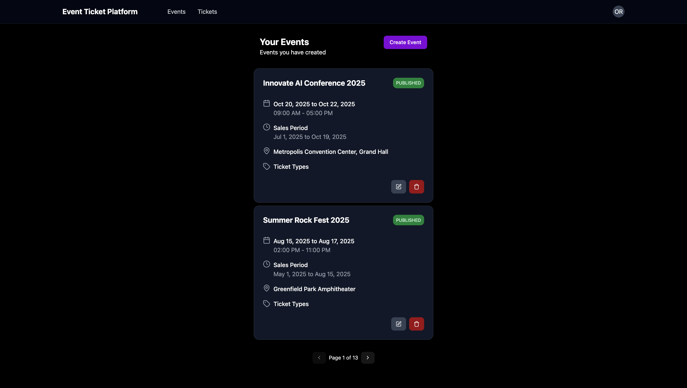
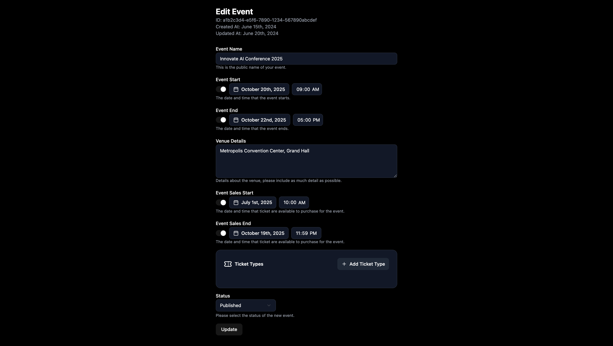
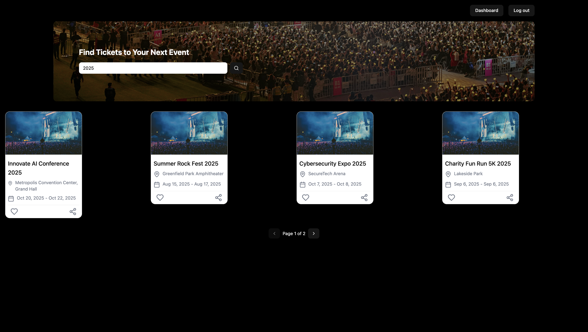
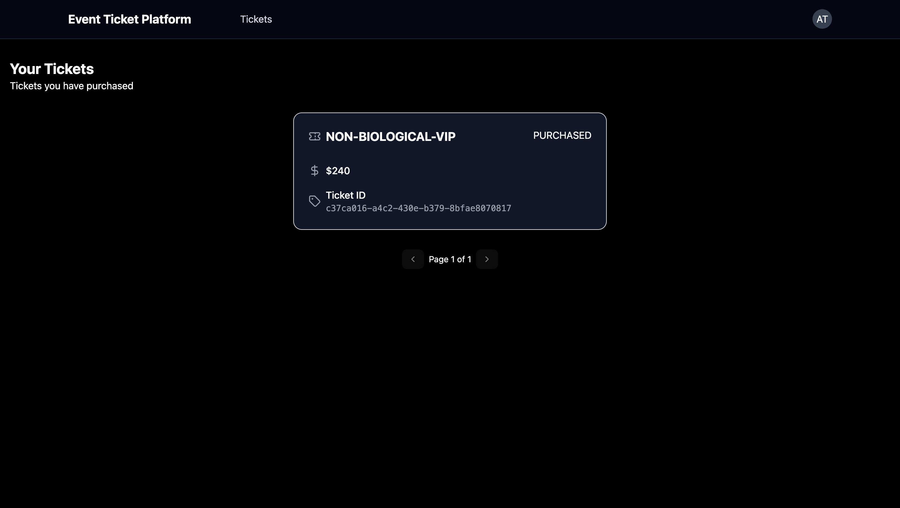
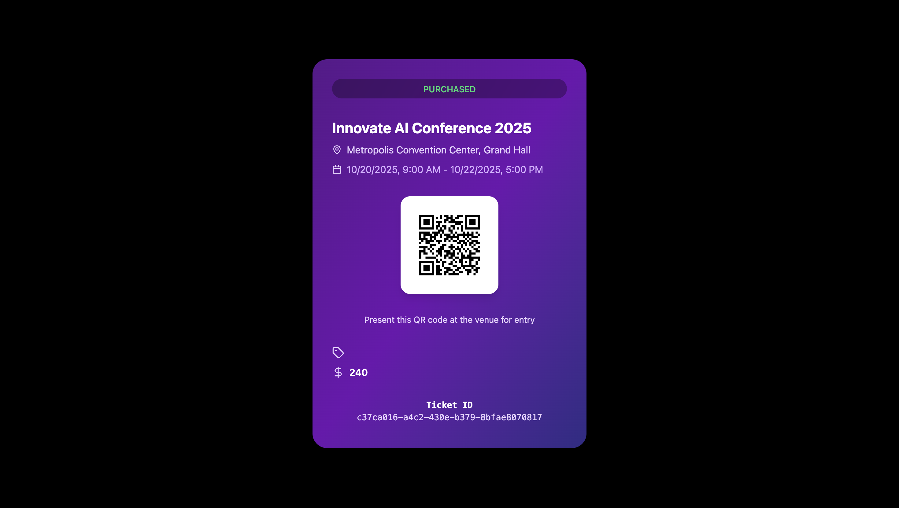

# Event Ticket Platform: Full-Stack Event Management Application


The Event Ticket Platform is a comprehensive, full-stack application designed for seamless event management. It empowers organizers to create, manage, and sell tickets for their events. Attendees can easily browse, purchase, and access their tickets, while event staff are equipped with tools to validate attendees via QR codes.

## Table of Contents
- [Demo](#demo)
- [Features](#features)
- [Technology Stack](#technology-stack)
- [Project Structure](#project-structure)
- [Setup and Installation](#setup-and-installation)
- [API Endpoints](#api-endpoints)
- [Contributing](#contributing)
- [License](#license)

## Demo

Here are some snapshots of the Event Ticket Platform in action.

**Organizer's Event Dashboard:** Manage all your created events from a central dashboard.
**

**Event Creation Form:** An intuitive form for creating and updating event details and ticket types.
**

**Public Event Page:** The public-facing page where attendees can view event details and purchase tickets.
**

**Attendee's Ticket View:** Attendees can view their purchased tickets and access the unique QR code for entry.
**

**QR Code Validation:** The mobile-friendly interface for staff to scan and validate tickets.
**

## Features

- **Role-Based Access Control (RBAC):**
  - **Organizer:** Manages events and ticket types.
  - **Attendee:** Browses events and purchases tickets.
  - **Staff:** Validates tickets at the event venue.

- **Event Management (For Organizers):**
  - **Full CRUD Operations:** Create, read, update, and delete events.
  - **Status Management:** Control event visibility by setting status to `DRAFT` or `PUBLISHED`.
  - **Flexible Ticketing:** Define multiple ticket types for an event (e.g., "General Admission", "VIP"), each with its own price, description, and available quantity.

- **Ticket Purchasing (For Attendees):**
  - **Event Discovery:** Browse and search for all published events.
  - **Secure Purchasing:** A streamlined (mock) checkout process to buy tickets.
  - **Personal Ticket Dashboard:** View all purchased tickets in a personal dashboard.

- **Ticket Validation (For Staff):**
  - **QR Code Scanning:** Use a device's camera to scan an attendee's QR code for quick validation.
  - **Manual Entry:** Option to validate a ticket by manually entering its ID.
  - **Instant Feedback:** The UI provides immediate visual feedback (`VALID`, `INVALID`).

- **Authentication:**
  - Secure user authentication and authorization handled by Keycloak using the OAuth 2.0 / OIDC protocol.

## Technology Stack

The project is a monorepo containing a Spring Boot backend and a React frontend.

### Backend (`tickets`)
- **Framework:** Spring Boot 3.5.0
- **Language:** Java 21
- **Authentication:** Spring Security with OAuth2 / JWT (connected to Keycloak)
- **Data Persistence:** Spring Data JPA / Hibernate
- **Database:** PostgreSQL
- **API:** RESTful API with Spring Web
- **Build Tool:** Maven
- **Utilities:** MapStruct, Lombok, ZXing (for QR code generation)

### Frontend (`tickets-fe`)
- **Library:** React 19 with TypeScript
- **Build Tool:** Vite
- **UI:** Tailwind CSS with custom components built using Radix UI primitives (similar to shadcn/ui).
- **Routing:** React Router
- **Authentication:** `react-oidc-context` to manage OIDC flow with Keycloak.
- **State Management:** React Hooks (`useState`, `useEffect`, `useContext`).

## Project Structure

The repository is organized into two primary directories: `tickets` for the backend and `tickets-fe` for the frontend.

```
.
├── tickets/                  # Spring Boot Backend
│   ├── pom.xml
│   └── src/
│       └── main/
│           ├── java/com/prp/tickets/
│           │   ├── controller/      # REST API Controllers
│           │   ├── domain/          # DTOs, Entities, Enums
│           │   ├── mappers/         # MapStruct Mappers
│           │   ├── repositories/    # Spring Data JPA Repositories
│           │   ├── services/        # Business Logic
│           │   └── config/          # Security, JPA, etc.
│           └── resources/
│               └── application.properties
│
└── tickets-fe/               # React Frontend
    ├── package.json
    ├── vite.config.ts        # Vite configuration with API proxy
    └── src/
        ├── components/       # UI components and layout
        ├── domain/           # TypeScript types and enums
        ├── hooks/            # Custom hooks (e.g., useRoles)
        ├── lib/              # API client and utilities
        ├── pages/            # Application pages/routes
        └── main.tsx          # App entry point with router and auth provider
```

## Setup and Installation

Follow these steps to get the application running on your local machine.

### Prerequisites
- Java JDK 21
- Apache Maven
- Node.js (v18 or later) & npm
- A running PostgreSQL instance
- A running Keycloak instance

### 1. Backend Setup (`tickets`)

1.  **Configure Keycloak:**
    - Set up a Keycloak realm named `event-ticket-platform`.
    - Create a client named `event-ticket-platform-app`.
    - Create user roles: `ROLE_ORGANIZER`, `ROLE_ATTENDEE`, `ROLE_STAFF`.
    - Create users and assign them the appropriate roles.

2.  **Configure Database & Keycloak Issuer:**
    - Navigate to `tickets/src/main/resources/application.properties`.
    - Update the `spring.datasource.*` properties to match your PostgreSQL configuration.
    - Update `spring.security.oauth2.resourceserver.jwt.issuer-uri` to point to your Keycloak realm.

    ```properties
    spring.datasource.url=jdbc:postgresql://localhost:5432/your_db_name
    spring.datasource.username=your_postgres_user
    spring.datasource.password=your_postgres_password

    spring.security.oauth2.resourceserver.jwt.issuer-uri=http://localhost:9090/realms/event-ticket-platform
    ```

3.  **Run the Backend:**
    - Open a terminal in the `tickets` root directory.
    - Run the application using Maven:
      ```bash
      mvn spring-boot:run
      ```
    - The backend server will start on `http://localhost:8080`.

### 2. Frontend Setup (`tickets-fe`)

1.  **Install Dependencies:**
    - Open a separate terminal in the `tickets-fe` directory.
    - Install the required npm packages:
      ```bash
      npm install
      ```

2.  **Configure API Proxy:**
    - To avoid CORS issues, the Vite development server will proxy API requests to the backend.
    - Create a file named `vite.config.ts` in the `tickets-fe` directory and add the following:

    ```typescript
    import { defineConfig } from 'vite'
    import react from '@vitejs/plugin-react-swc'
    import path from "path"

    export default defineConfig({
      plugins: [react()],
      resolve: {
        alias: {
          "@": path.resolve(__dirname, "./src"),
        },
      },
      server: {
        proxy: {
          '/api': {
            target: 'http://localhost:8080', // Spring Boot backend
            changeOrigin: true,
            secure: false,
          },
        },
      },
    })
    ```

3.  **Run the Frontend:**
    - In the `tickets-fe` terminal, start the development server:
      ```bash
      npm run dev
      ```
    - The frontend application will be available at `http://localhost:5173`.

You can now access the Event Ticket Platform in your browser!

## API Endpoints

The backend exposes the following RESTful API endpoints, secured with JWTs.

### Organizer Endpoints (`ROLE_ORGANIZER`)
| Method | Path                  | Description                     |
| :----- | :-------------------- | :------------------------------ |
| `POST` | `/api/v1/events`      | Create a new event.             |
| `GET`  | `/api/v1/events`      | Get all events for the organizer.|
| `GET`  | `/api/v1/events/{id}` | Get a single event by ID.       |
| `PUT`  | `/api/v1/events/{id}` | Update an existing event.       |
| `DELETE`|`/api/v1/events/{id}`| Delete an event.                |

### Attendee Endpoints (Authenticated)
| Method | Path                                   | Description                    |
| :----- | :------------------------------------- | :----------------------------- |
| `POST` | `/api/v1/events/{eventId}/ticket-types/{ticketTypeId}/tickets` | Purchase a ticket. |
| `GET`  | `/api/v1/tickets`                      | Get all tickets for the user.  |
| `GET`  | `/api/v1/tickets/{id}`                 | Get a single ticket by ID.     |
| `GET`  | `/api/v1/tickets/{id}/qr-codes`        | Get the QR code image for a ticket. |

### Staff Endpoints (`ROLE_STAFF`)
| Method | Path                     | Description                 |
| :----- | :----------------------- | :-------------------------- |
| `POST` | `/api/v1/ticket-validations` | Validate a ticket via QR/manual.|

### Public Endpoints (No Auth)
| Method | Path                        | Description                 |
| :----- | :-------------------------- | :-------------------------- |
| `GET`  | `/api/v1/published-events`  | Get all published events. Can be searched with `?q=query`. |
| `GET`  | `/api/v1/published-events/{id}` | Get details for a single published event. |

## Contributing

Contributions make the open-source community an amazing place to learn, inspire, and create. Any contributions you make are **greatly appreciated**.

1.  Fork the Project
2.  Create your Feature Branch (`git checkout -b feature/AmazingFeature`)
3.  Commit your Changes (`git commit -m 'Add some AmazingFeature'`)
4.  Push to the Branch (`git push origin feature/AmazingFeature`)
5.  Open a Pull Request

## License

This work is licensed under the [Creative Commons Attribution-NonCommercial-ShareAlike 4.0 International License](https://creativecommons.org/licenses/by-nc-sa/4.0/).

**Attribution:**
"Build a Blog Platform App by Devtiro is licensed under CC BY-NC-SA 4.0. Original content available at https://www.youtube.com/@devtiro and https://www.devtiro.com."